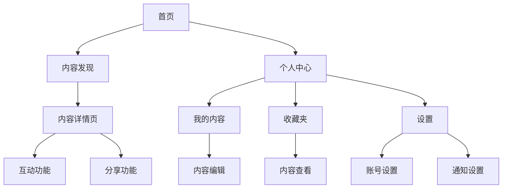

```markdown
# 产品需求文档（PRD）：MCP服务

## 1. 产品概述
MCP服务（Micro Content Platform）是一个轻量级的内容服务平台，旨在为用户提供简单高效的内容管理、分发和消费体验。该服务专注于处理小型内容单元（如短文本、图片、短视频等），通过简洁的交互设计和智能推荐算法，帮助用户快速获取和分享有价值的内容。

## 2. 目标用户
- **内容创作者**：需要快速发布和管理小型数字内容的个人或机构
- **内容消费者**：希望高效获取和收藏有价值内容的普通用户
- **企业用户**：需要轻量级内容管理解决方案的中小企业
- **开发者**：寻求内容API服务集成的技术人员

## 3. 核心功能

### 3.1 内容管理
- 内容创建（支持文本/图片/短视频）
- 内容分类与标签管理
- 内容版本控制
- 批量操作功能

### 3.2 内容分发
- 智能推荐引擎
- 基于用户画像的个性化推送
- 多渠道发布（Web/App/API）
- 定时发布功能

### 3.3 用户交互
- 收藏/点赞/评论功能
- 内容分享（社交媒体集成）
- 用户反馈收集
- 阅读历史记录<!-- slide -->


### 3.4 数据分析
- 基础内容分析（浏览量/互动量）
- 用户行为分析
- 转化率追踪
- 可视化报表导出

## 4. 页面结构流程图



## 5. 非功能性需求

### 5.1 性能需求
- 页面加载时间：<1.5秒（首屏）
- API响应时间：<500ms（P99）
- 支持1000+并发用户
- 99.9%服务可用性

### 5.2 安全需求
- 数据加密传输（TLS 1.2+）
- 用户认证（OAuth 2.0）
- 敏感数据加密存储
- 定期安全审计

### 5.3 可扩展性
- 模块化架构设计
- 支持水平扩展
- API优先设计理念
- 微服务架构兼容性

### 5.4 兼容性
- 浏览器兼容：Chrome/Firefox/Safari/Edge最新2个版本
- 移动端适配：iOS/Android主流机型
- 分辨率适配：1920×1080 ~ 375×667

### 5.5 运营需求
- 多语言支持（初始版本支持中英文）
- 内容审核系统
- 用户举报机制
- A/B测试框架
```